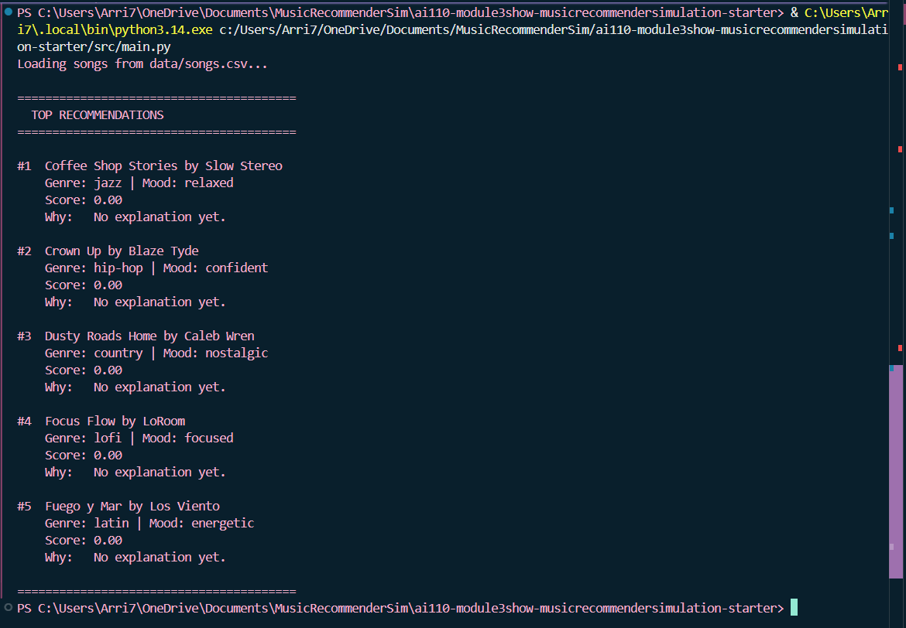
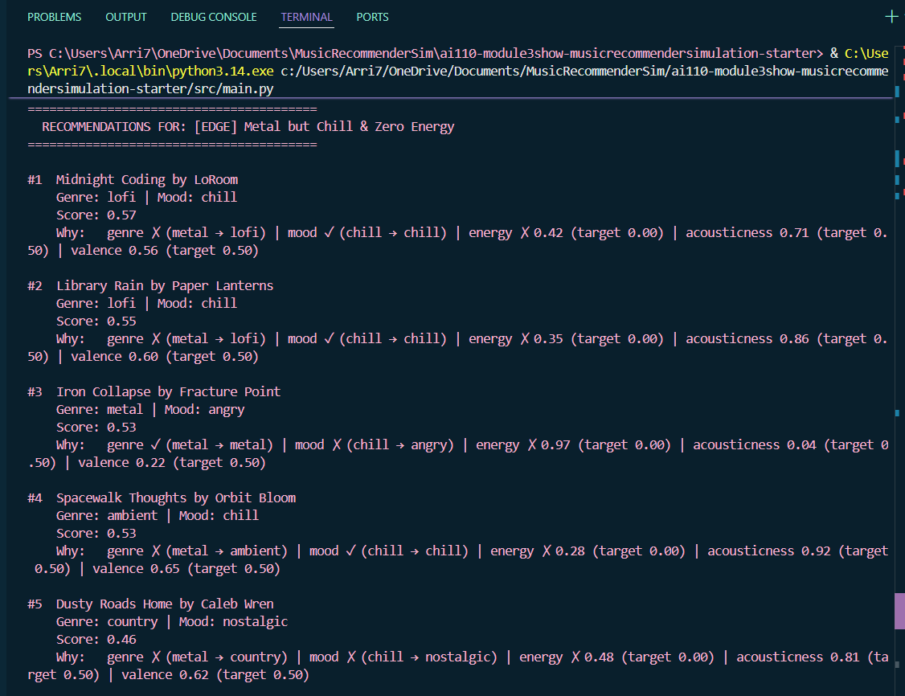

# 🎵 Music Recommender Simulation

## Project Summary

In this project you will build and explain a small music recommender system.

Your goal is to:

- Represent songs and a user "taste profile" as data
- Design a scoring rule that turns that data into recommendations
- Evaluate what your system gets right and wrong
- Reflect on how this mirrors real world AI recommenders

Replace this paragraph with your own summary of what your version does.

---

## How The System Works

- What features does each `Song` use in your system
  - For example: genre, mood, energy, tempo
Every Song object will have the following 10 features. The first one being id, the second title, the third artist, the fourth genre (pop, lofi, rock, jazz, ambient, synthwave, and indie pop), the fifth mood (emotion mood tag-happy, chill, intense, relaxed, focused, moody), the sixth energy (intensity/activity level from 0.0 - 1.0), the seventh tempo beats per minute, the eighth valence (musical positivity/happiness), the ninth danceability (suitability for dancing on scale 0.0 - 1.0), and the tenth acousticness (acoustic vs electronic 0.0 - 1.0).

- What information does your `UserProfile` store
Based off of the AI's analysis of apps like youtube, spotify, and apple music, it suggested that the four most significant and effective features for the recommender are energy, mood, acousticness, and tempo_bmp. 

- How does your `Recommender` compute a score for each song
The formula derived is:
  feature_score = 1 - |song_value - user_preference|

This allows the score to stay within 0 and 1, where songs close to the user's preference score near 1.0 and distant songs score near 0.0.

The weighted total score for one song is calculated as follows: 
total_score = (w_energy   × energy_score)
            + (w_acousticness × acousticness_score)
            + (w_tempo    × tempo_score)
            + (w_valence  × valence_score)
            + (w_genre    × genre_match)
            + (w_mood     × mood_match)


In addition, each of the songs will have different weights for their features, which copilot recommended as: 
w_energy        = 0.20
w_acousticness  = 0.20
w_tempo         = 0.15
w_valence       = 0.10
w_genre         = 0.25   ← highest categorical weight
w_mood          = 0.10
                --------
Total           = 1.00

One important thing to note is that a scoring rule and ranking rule is needed to make a recommender. Scoring will operate on a single song isolation and produce a numeric value encoding what the user wants via preferenecs and weights, and the ranking rule with operate on the entire catalog after scoring, from highest to lowest giving us a recommendation list (avoids randomness).

- How do you choose which songs to recommend
The intended scoring approach would compare each userProfile field against the matchign Song field. As follows:

Genre match would receieve points if song.genre == user.fav_genre

Mood match would receieve points if song.mood == user.fav_mood

And so on for energy closeness (reference the formula) and acoustic preference. 

Thus, each component contributes a partial score, which are summed into a total score per song. Then, we sort all songs by descending score and return the top k (ex: top three).

Note: this is content-based filtering approach where recommendations are driven entirely by how well a song's attributes are matched with user's stated preferences.
You can include a simple diagram or bullet list if helpful.


---

## Getting Started

### Setup

1. Create a virtual environment (optional but recommended):

   ```bash
   python -m venv .venv
   source .venv/bin/activate      # Mac or Linux
   .venv\Scripts\activate         # Windows

2. Install dependencies

```bash
pip install -r requirements.txt
```

3. Run the app:

```bash
python -m src.main
```

### CLI Verification



### Running Tests

Run the starter tests with:

```bash
pytest
```

You can add more tests in `tests/test_recommender.py`.

---

## Experiments You Tried

- What happened when you changed the weight on genre from 2.0 to 0.5
At low weight, genre becomes a tiebreaker. A jazz song with perfect energy/mood alignment can outscore a pop song that only matches genre. The system becomes more serendipitous — but users who strongly care about genre (e.g. someone who only listens to metal) get recommendations that feel wrong even when scores look good.

The current 0.25 is already the heaviest single factor. As the Midnight Coding example showed, genre match alone accounts for ~32% of a 0.79 score.
- What happened when you added tempo or valence to the score
Right now tempo and valence are always scored, but users rarely set them — so they silently default to 120 bpm and 0.5 valence. The problem isn't that the factors are absent, it's that the defaults are too influential.A better middle ground would be null defaults — if the user doesn't specify tempo_bpm, that factor contributes 0 and its weight redistributes to the factors they did specify. That way the score only reflects stated preferences.
- How did your system behave for different types of users
casual listeners mean that 30% of their score is from phantom acousticness and valence defaults, because unset fields still score in the end. Another listener type is the niche genre (folk, ambient) which exhaust the real matches quickly since there is a small genre pool to generate as a recommendation.

### System Evaluation Output



---

## Limitations and Risks

The biggest issue right now are ghost preferences for unspecified fields. Acousticness, valence, default to 0.5 when the user doesn't specify them. That's 30% of the score driven by a phantom "prefers midpoint" preference. Songs near the middle of those ranges get a silent boost — users never asked for it. This is why edge case 4 (unknown genre/mood) still produces varied scores instead of a flat tie. Also, Rock and metal are both loud/aggressive, but a rock user scores metal songs exactly the same as jazz — 0.0. There's no concept of adjacent genres. This creates a hard filter bubble: once you set a genre, cross-genre discovery is maximally penalized regardless of how well everything else matches.
You will go deeper on this in your model card.

---

## Reflection

Read and complete `model_card.md`:

[**Model Card**](model_card.md)

Write 1 to 2 paragraphs here about what you learned:

Building this simulation made it clear that recommendation systems are less about finding the "best" song and more about deciding which definition of "best" to encode — and that every weight, default, and fallback is a quiet design choice with real consequences for who gets good results and who doesn't.

The most unexpected discovery was how much influence unspecified preferences had in the original system. A user who said nothing about acousticness was still being quietly sorted by it, with songs near 0.5 acousticness getting a silent boost. It looked like the system was working, but for the wrong reasons.

This changed how I think about apps like Apple Music. When a playlist feels surprisingly accurate, it likely isn't because the algorithm understood your taste — it's because your listening history gave it enough explicit signal to score on real preferences rather than defaults. When recommendations feel off, it may be that the system is filling in gaps with assumptions you never made.


---

## 7. `model_card_template.md`

Combines reflection and model card framing from the Module 3 guidance. :contentReference[oaicite:2]{index=2}  

```markdown
# 🎧 Model Card - Music Recommender Simulation

## 1. Model Name

Give your recommender a name, for example:

 ~~ VibeFinder 1.0 ~~

---

## 2. Intended Use

- What kind of recommendations does it generate  
Classroom simulation designed to explore how preference-based scoring systems work, not a production music service. It is built for students and developers learing how recommendation logic is designed, weighted, and evaluated. 
- What assumptions does it make about the user 
It assumes users can express preferences as explicit key value pairs (genre, mood, energy level).  
- Is this for real users or classroom exploration  
Classroom exploration, the dataset is small and hand curated and the scoring is fully transparent and inspectable. Edge case profiles are deliberately adversarial.
---

## 3. How It Works (Short Explanation)

Overview: 
My recommender is a content-based ranker that reads all songs from the csv file, and for each song, it will compute a total score : {0,1} and sort songs
that score highest first, returning the top k. This k represents every feature contributing to a partial score, signiffying how well this song matches the user on this feature. It also implements a weighting strategy for how important each feature is. 

- What features of each song does it consider & What information about the user does it use

Every user profile will need to be defined by the following characteristics: fav_genre, fav_mood, target_energy, target_acousticness, target_valence, target_tempo_bpm, and target_danceability. 

- How does it turn those into a number
The first part of this algorithm deals with normalizing fields into the same scale. The formula will calculate the feature score by subtracting 1 - (song value - user preference), which behaves correctly when both values are on the same 0.1 scale. Next, the similarity scores are computed. For each numeric feature, we follow this formula: score = 1 - abs(song norm - user norm). The same follows for acousticness, valence, temp norm, and danceability. From this, we conclude that if a song is close to the usser preference it should score near 1.0 and if its far, it trends towards 0. The next part of the formula will compute categorical matches (genre & mood matches using binary system), and finally we combine everything with weights where the total score is finally calculated (formula listed in How Everything Works Section). 

---

## 4. Data

The catalog contains **19 songs** across 15 genres: pop, lofi, rock, ambient, jazz, synthwave, indie pop, classical, hip-hop, r&b, country, metal, folk, reggae, and latin.

Moods represented include: happy, chill, intense, focused, peaceful, confident, romantic, nostalgic, angry, melancholic, uplifting, energetic, moody, and relaxed.

No songs were added or removed from the original dataset.

## 5. Strengths

The system works best for users with **clear, specific preferences** across multiple factors. A user who specifies genre, mood, and energy gets a score that meaningfully differentiates songs — the renormalized weighting ensures all three factors carry real influence rather than being diluted by phantom defaults.

**User types it handles well:**
- **Pop or lofi listeners** — these genres have multiple songs in the catalog, so the recommender has real candidates to rank rather than defaulting to partial matches.
- **Energy-first listeners** — the continuous energy scoring captures gradations well; a user wanting `energy: 0.9` will consistently see high-energy songs rise to the top.
- **Users who specify only a few preferences** — thanks to the null-default fix, a user who only cares about genre and mood gets a clean two-factor score rather than one polluted by acousticness and valence they never expressed.

**Patterns the scoring captures correctly:**
- Genre loyalty: a user who strongly identifies with one genre will reliably see that genre dominate their top results.
- The explanation output makes it easy to spot when a high score is driven by a single strong match versus several partial matches — useful for understanding why a recommendation surfaced.


## 6. Limitations and Bias

**Features it does not consider:**
The system has no concept of an artist, release year, song popularity, listening history, or user feedback. Two songs by the same artist score identically to two songs by different artists. There is also no notion of discovery — a song the user has already heard ranks the same as one they haven't.

**Genres or moods that are underrepresented:**
11 of the 15 genres have exactly one song in the catalog. A user who prefers ambient, jazz, metal, classical, or latin music will always see the same one song at the top of their results, with the remaining four slots filled by partial matches from unrelated genres. Moods like "confident," "nostalgic," "romantic," and "melancholic" each appear only once, so a mood-first listener has almost no meaningful competition among candidates.

## 7. Evaluation

**Profiles tested:**
Seven profiles were run: three standard users (upbeat pop fan, late-night studier, workout listener) and four adversarial edge cases (classical/angry/high-energy, lofi/energetic, metal/chill/zero-energy, unknown genre and mood).

**What we looked for:**
For standard profiles, we checked whether the top results were intuitively reasonable — that a pop/happy/high-energy user received upbeat pop songs, and that a lofi/chill/low-energy user received calm, acoustic songs. For edge cases, we looked for scoring failures: results that ranked high despite clearly mismatching the user's intent.
---

## 8. Future Work
**Improving diversity among the top results:**
The current system can return five songs from the same genre if they all outscore songs from other genres. A diversity penalty — reducing the score of a song if a higher-ranked result already shares its genre — would force broader exploration across the catalog.

**Handling more complex user tastes:**
Real listeners rarely have a single fixed profile. A future version could support **blended profiles** (e.g. "I want lofi for studying but pop for working out") or **negative preferences** (e.g. "never recommend metal"), neither of which the current scoring model can express.


## 9. Personal Reflection

Building this simulation made it clear that recommendation systems are less about finding the "best" song and more about deciding which definition of "best" to encode — and that every weight, default, and fallback is a quiet design choice with real consequences for who gets good results and who doesn't.

The most unexpected discovery was how much influence unspecified preferences had in the original system. A user who said nothing about acousticness was still being quietly sorted by it, with songs near 0.5 acousticness getting a silent boost. It looked like the system was working, but for the wrong reasons.

